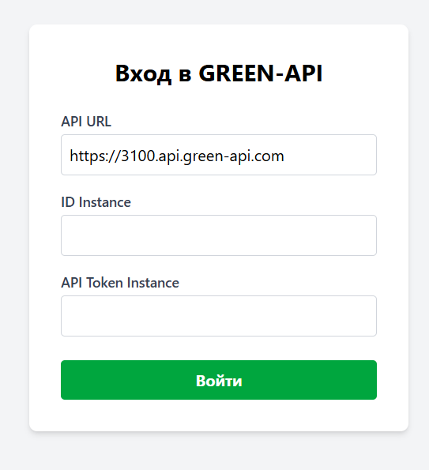
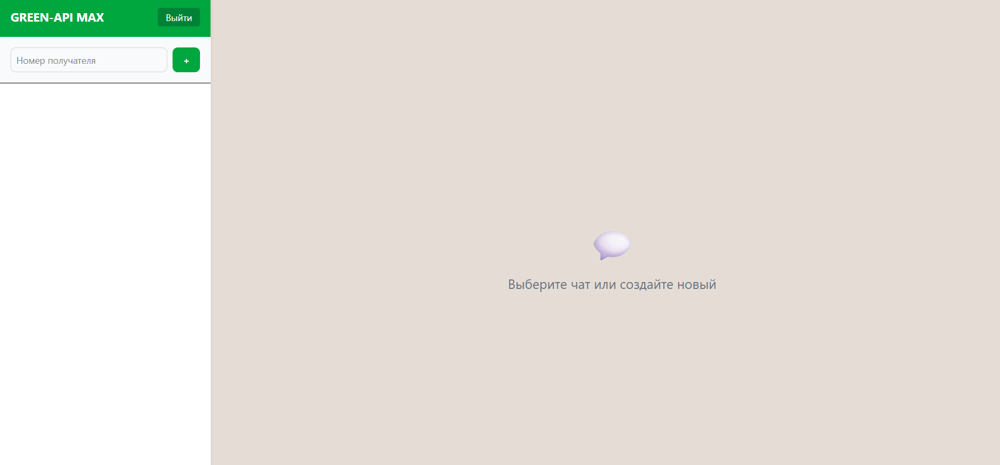

# GREEN-API MAX

Веб-интерфейс для отправки и получения текстовых сообщений через сервис [GREEN-API](https://green-api.com/) для мессенджера MAX.

## Демо




## Функциональность

- Авторизация по `apiUrl`, `idInstance`, `apiTokenInstance` с проверкой через `getStateInstance`
- Создание нового чата по номеру телефона получателя
- Отправка текстовых сообщений (`sendMessage`)
- Получение входящих сообщений через HTTP Polling (`receiveNotification` / `deleteNotification`)
- Автоматическое определение `chatId` по номеру телефона (`checkAccount`)
- Сохранение истории чатов в `localStorage`
- Удаление чатов
- Cообщения об ошибках (401, 404, 466, ошибки сети)
- Покрытие тестами

## Установка и запуск

1. Клонировать репозиторий
```bash
git clone <URL_РЕПОЗИТОРИЯ>
cd greenApiMax
```

2. Установить зависимости
```bash
npm install
```

3. Запустить dev-сервер
```bash
npm run dev
```

Приложение откроется на [http://localhost:5173](http://localhost:5173)

### Как получить доступы

1. Зарегистрируйтесь на [console.green-api.com](https://console.green-api.com).
2. Создайте инстанс MAX (бесплатный тариф «Разработчик»).
3. Скопируйте из личного кабинета:
   - `apiUrl` (например, `https://3100.api.green-api.com`)
   - `idInstance`
   - `apiTokenInstance`
4. В личном кабинете включите получение уведомлений:
   - **«Получать уведомления о входящих сообщениях и файлах» → Да**
   - **«Получать уведомления о сообщениях, отправленных с телефона» → Да**
5. Введите эти данные в форму авторизации приложения.

## Тестирование

Запуск в watch-режиме (для разработки)
```bash
npm test
```

Однократный запуск (для CI)
```bash
npm run test:run
```
С покрытием
```bash
npm run test:coverage
```